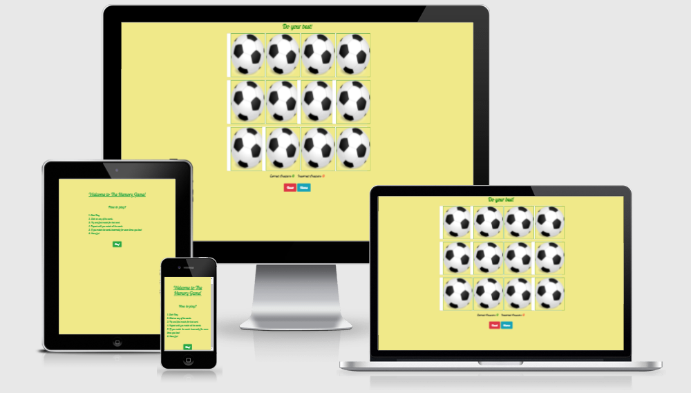
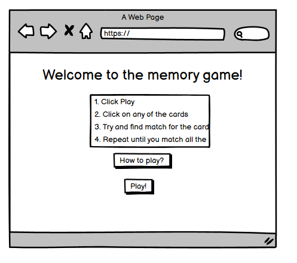
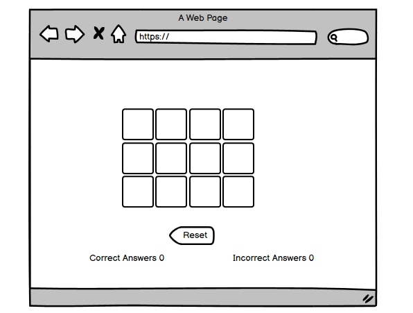
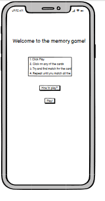
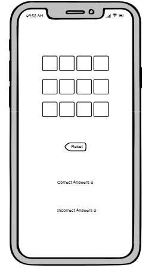
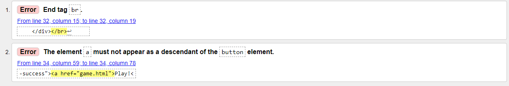
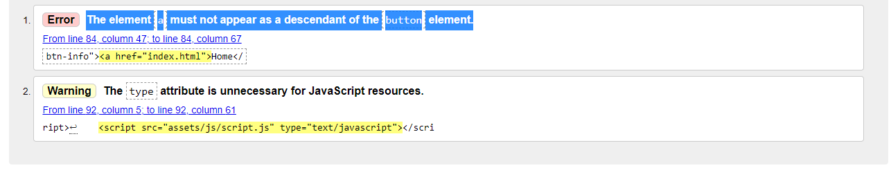

 # Memory Game Website

 [Live site](https://itisahmedh.github.io/portfolio-project-2/)

A website to play a memory game and have fun.

 

 # User Experience (UX) 

 ## User Stories
It is built for users to play the game and enjoy.

 ## Design
* Color Scheme
    Two main colors used are:
    -  `#28a745`
    -  `#f0e989`
* Typography

* Using [Google Fonts](https://fonts.google.com/) the website uses "Lobster Two" font as the main font and "cursive" as a backup font.

 ## Wireframes

 - Desktop Wireframes
   - 
   - 
 
 - Mobile Wireframes
   - 
   - 

# Features 

- Responsive for all devices
- Has interacitve elements

## Future Features

Adding levels to the game to make it harder or easier.

# Technologies Used

## Languages Used

* [HTML5](https://en.wikipedia.org/wiki/HTML5)
* [CSS3](https://en.wikipedia.org/wiki/CSS)
* [JavaScript](https://en.wikipedia.org/wiki/JavaScript)

## Frameworks and Programs used
1. [Gitpod](https://gitpod.io/)
    - Used to write the code.
1. [Git](https://git-scm.com/)
    - Used for version control
1. [GitHub:](https://github.com/)
    - Used to store the code
1. [Google Fonts:](https://fonts.google.com/)
    - Used for the fonts
1. [Bootstrap 4.4.1:](https://getbootstrap.com/docs/4.4/getting-started/introduction/)
    - Used to make the site more responsive
1. [Balsamiq:](https://balsamiq.com/)
    - Used to make the wireframes

# Testing 
## Validators

- [W3C Markup Validator](https://validator.w3.org/#validate_by_input)
  - Used to validate the HTML in every page, it resulted in the following errors which has been solved.
  - 
  - 
-  [Jigsaw CSS Validator](https://jigsaw.w3.org/css-validator/#validate_by_input) 
   - Used for CSS and no errors were found.

## Further Testing

- Tested using chrome inspect tools.
- Tested on a desktop browser and mobile phone.
- Tested JavaScript using the console in chrome.

## Unresolved bugs

- The card images look somewhat distorted

# Deployment
1. The code is written using [Gitpod](https://gitpod.io/)
1. Using [Git](https://git-scm.com/) in the terminal the code is commited and pushed to a [GitHub:](https://github.com/) repository.
1. The site is then deployed using [Github pages](https://pages.github.com/) using the following steps
   1. Open the Github repository
   1. Go to settings
   1. Go to pages
   1. In sources choose main
   1. Click save

   # Credits

   ## Code 
   - The game code was made with the help of this [Youtube](https://www.youtube.com/watch?v=ZniVgo8U7ek) video
   - The score are was inspired from [Love Maths Project](https://github.com/Code-Institute-Solutions/love-maths-2.0-sourcecode/tree/master/05-tidying-up/01-a-few-last-things)
   - [Stackoverflow](https://stackoverflow.com/questions/16955019/how-to-reload-a-page-after-the-ok-click-on-the-alert-page)

   ## Media
   Image Used were from 
   [Wikipedia](https://en.wikipedia.org/)
   [Seek png](seekpng.com)
   [Stick png](stickpng.com)
